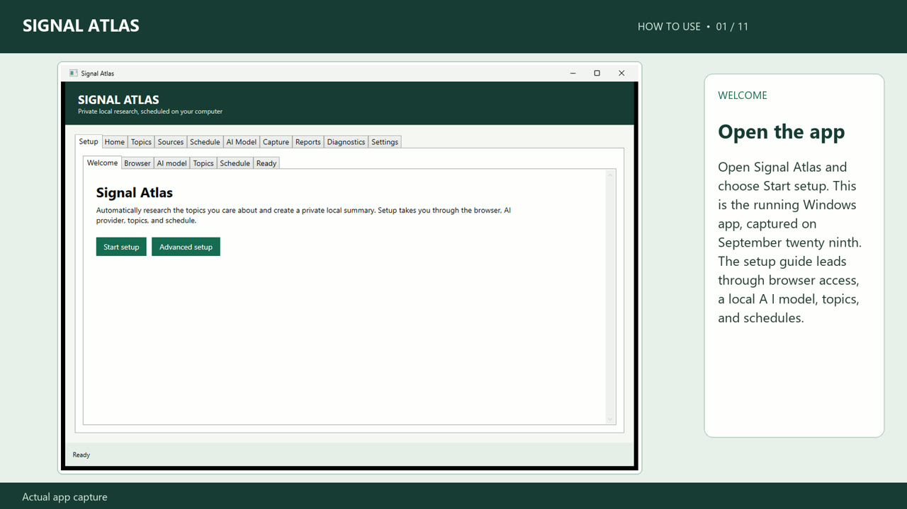

# Signal Atlas

A Windows desktop app that discovers research for chosen topics, stores findings in SQLite, and analyzes them with a selected AI provider. Choose the original card digest, a professional research report in HTML and PDF, or both. Reports have a selectable 1–20 page target, cited analysis, conclusions, references, and optional specialized sections.

## Watch a real research run

[](https://hoodierat.github.io/signal-atlas/)

**[▶ Watch the video with captions](https://hoodierat.github.io/signal-atlas/)** · [Download the MP4](https://hoodierat.github.io/signal-atlas/demo/Signal-Atlas-Live-Demo.mp4?v=elevenlabs-v1)

The video has ElevenLabs narration and walks through a report Signal Atlas generated from three public Epic Games pages about Unreal Engine 5.8. [The real card digest, HTML report, PDF, source list, and video method](demo/README.md) are available for inspection.

## Download and install on Windows

**Download the [Signal Atlas Windows ZIP](https://github.com/HoodieRat/signal-atlas/releases/tag/v1.0.0-preview).** Choose the `SignalAtlas-...-win-x64.zip` asset, rather than GitHub's **Code → Download ZIP**, which contains source files.

1. In File Explorer, right-click the downloaded ZIP and choose **Extract All**.
2. Open the extracted `SignalAtlas` folder, then its `scripts` folder.
3. **Double-click `Setup.bat`** and wait for setup to finish. It installs the app and creates a Start menu shortcut.
4. Open **Signal Atlas** from the Windows Start menu. You only need `Setup.bat` for installation; use the Start menu thereafter.

The release is for Windows 10 or 11 x64 and includes the .NET runtime. No programming tools or .NET SDK are needed. DokoBot is installed separately for browser capture. AI is required to write research reports; discovery cards work without it. See [AI provider setup](docs/AI_PROVIDERS.md) when you are ready for analysis.

## Try a first scan

1. In **Setup → Topics**, click **Add example topics**.
2. Go to **Home** and click **Discover links only**. This tests discovery and creates source cards without an AI account.
3. When the run finishes, open **Reports**, select the newest result, and click **Open cards**. Research outputs are saved under `Documents\Signal Atlas\Reports`.
4. For the full workflow, complete **Setup → Browser**, choose and test a provider in **AI Model**, then click **Run Now** on Home. Leave scheduled monitoring off until the manual test succeeds.

Browser capture requires DokoBot and its browser bridge. Its in-app installer requires Node.js LTS. See [architecture](docs/ARCHITECTURE.md) for how runs work.

## Choose cards, reports, or both

In **Reports → Research output**, choose the output mode, a page target from 1 to 20, a general/technical/business profile, the research question, and the audience. Select applicable comparisons, timelines, risk registers, action plans, glossaries, quantitative exhibits, methodology, or appendices. Save preferences to apply them to manual and scheduled runs.

Reports are planned and written section by section from retained evidence. Each paragraph and table row has source references. Quantitative charts require numbers present in the source text. The PDF supplies final pagination, a cover and contents for longer documents, numbered exhibits, linked citations, and page numbers. The writer can shorten a draft to meet the selected limit; it does not add filler to reach it. Thin evidence can produce fewer pages. If report writing fails, source cards remain available and explain the failure.

The writer uses a larger evidence window with cloud providers and adapts excerpts to the loaded local model's context. Small local contexts may need increasing in **Settings** for longer reports or multiple specialized elements. Citation checks establish valid references; review substantive claims against the linked evidence before relying on a report.

Use the separate **Open cards**, **Open report**, **Open PDF**, and export buttons for a saved run. HTML exports are self-contained; PDF export does not require a browser or an online conversion service.

## AI choices

| Provider | Account setup | Where analysis runs |
| --- | --- | --- |
| LM Studio | Install a local model | On this computer |
| OpenAI API | Supply `OPENAI_API_KEY` at runtime | OpenAI API, billed to the API project |
| Codex with ChatGPT | Install Codex CLI and sign in with ChatGPT | Codex using the signed-in account's available usage |

Signal Atlas does not write API keys or Codex login tokens to SQLite, reports, logs, or this repository. Cloud options send the selected source text to OpenAI for analysis. Availability and usage limits depend on the account and provider. The local option remains the default.

## LinkedIn controls

The **Block LinkedIn DokoBot reads** switch defaults on. Scheduled scans can still discover public indexed LinkedIn links. Turning the switch off enables sequential DokoBot reads of discovered LinkedIn pages and user-selected URL batches. The Capture screen can also import text the user copied from a page. This setting affects Signal Atlas; DokoBot itself is unchanged. Review [LinkedIn design and policy](docs/LINKEDIN_DESIGN.md) before changing the switch.

## Data and privacy

By default, the database, content, and logs live under `%LOCALAPPDATA%\SignalAtlas`; HTML reports live under `%USERPROFILE%\Documents\Signal Atlas`. These paths are outside the source checkout. `SIGNALATLAS_DATA_ROOT` and `SIGNALATLAS_REPORTS_ROOT` can override them for isolated testing. Runtime data, credentials, generated release files, and local validation files are excluded from Git.

The demo uses current, public Epic Games source pages and an isolated app data root. No personal LinkedIn account or private research database appears in it.

## Develop and verify

For development from source, install the [.NET 8 SDK](https://dotnet.microsoft.com/download/dotnet/8.0). `scripts/Build-Release.ps1` builds a self-contained local package; `scripts/Package-Release.ps1` builds the distributable ZIP. These steps are for maintainers, not for installing the downloaded release.

```powershell
dotnet restore SignalAtlas.sln
dotnet build SignalAtlas.sln --no-restore
dotnet test SignalAtlas.sln --no-build
python scripts/check_secrets.py
powershell -ExecutionPolicy Bypass -File scripts/Package-Release.ps1
```

See the [implementation plan](PLAN.md), [production specification](docs/PRODUCTION_SPEC.md), and [test plan](docs/TEST_PLAN.md). Security issues and private disclosure guidance are in [SECURITY.md](SECURITY.md).

No redistribution license has been selected by the project owner.
